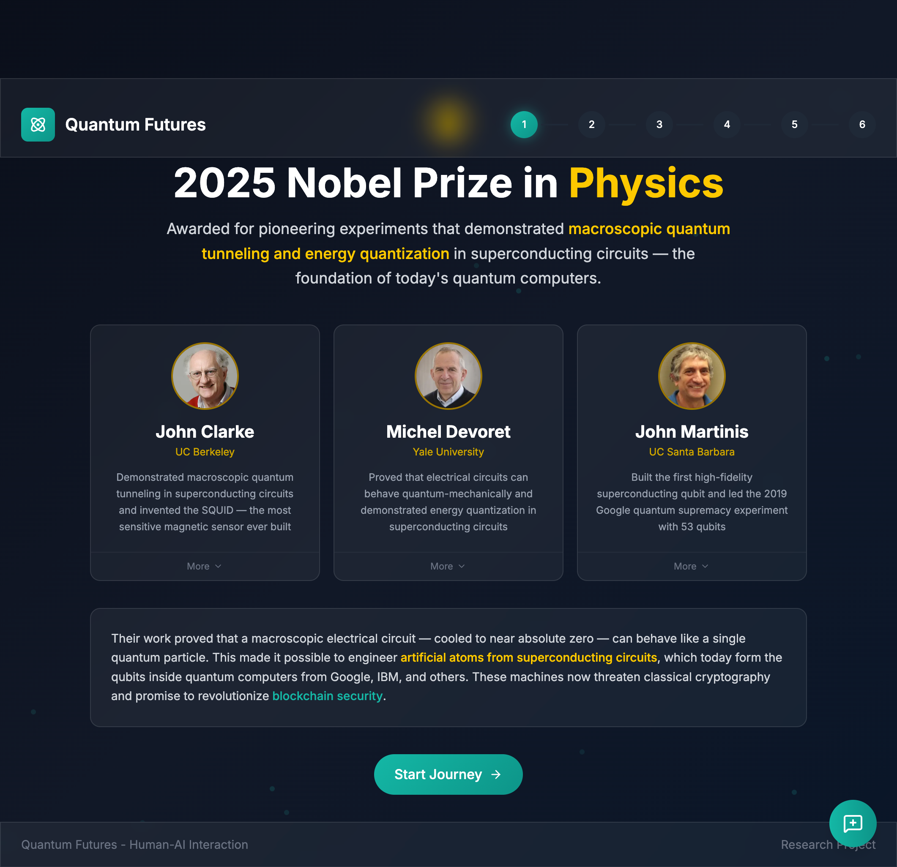
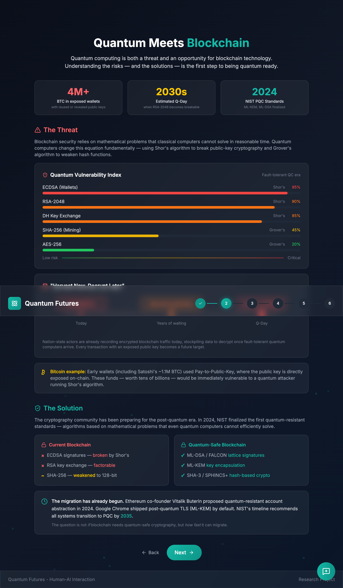
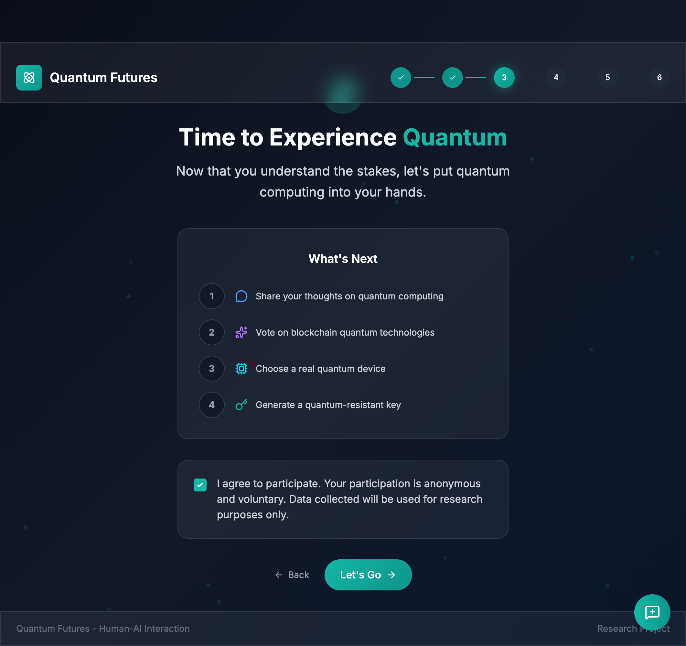
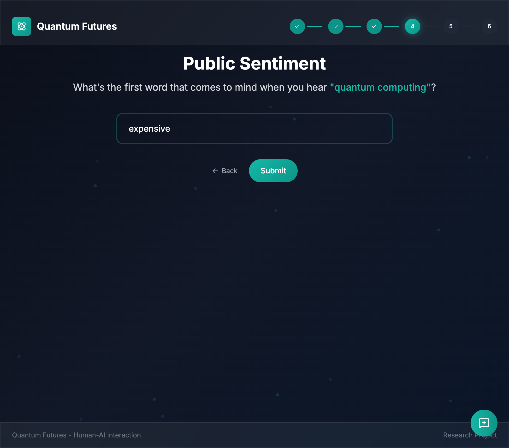
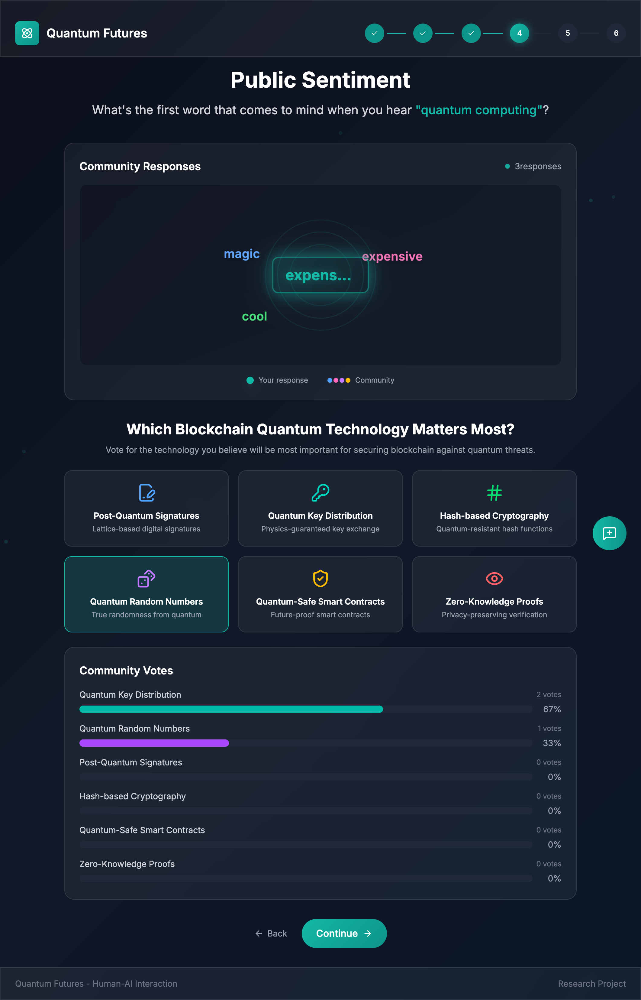
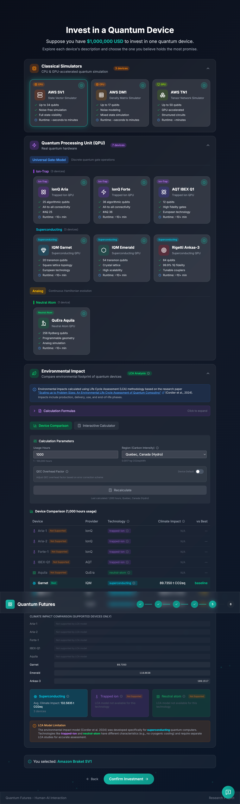
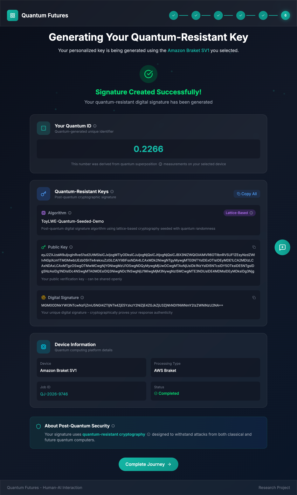

# Quantum Futures Interactive — UI Page Descriptions

This document provides a **technical, implementation-oriented walkthrough** of each user interface screen in **Quantum Futures Interactive**. It is written for engineers, designers, researchers, and reviewers who require a structured understanding of **screen purpose, user flow, captured data, and system intent**.

> ✅ **Note:** References to Nobel Prize recognition within the experience reflect real-world scientific developments. In particular, references to the 2025 Nobel Prize in Physics align with the official Nobel Foundation press release:
> https://www.nobelprize.org/prizes/physics/2025/press-release/

---
## 🔬 Scientific Background

Quantum Futures Interactive is designed as an **educational and exploratory interface** demonstrating how advances in quantum information science influence modern digital infrastructure.

Recent Nobel-recognized work in quantum physics reflects foundational progress in areas such as:

* quantum information processing,
* quantum state control and measurement,
* and scalable quantum systems.

These advances have direct implications for cryptography. Certain quantum algorithms — most notably Shor’s algorithm — theoretically weaken widely used public-key systems such as RSA and elliptic curve cryptography. As a result, the cybersecurity and blockchain communities are actively researching **post-quantum cryptography (PQC)** as a long-term mitigation strategy.

The experience does not claim operational quantum advantage over current cryptographic systems. Instead, it illustrates:

* why quantum progress motivates cryptographic migration planning,
* how post-quantum standards are being developed (e.g., NIST PQC process),
* and how emerging technologies may intersect with decentralized systems and digital identity.

This context supports the educational goals of the experience while maintaining scientific accuracy and neutrality.

## 📚 Contents

* [UX Flow Summary](#ux-flow-summary)
* [Screens](#screens)

  * [1. 🚀 Welcome](#1--welcome-page-1png)
  * [2. ⚛️ Quantum Meets Blockchain](#2--quantum-meets-blockchain-page-2png)
  * [3. ✅ Experience Overview / Consent](#3--experience-overview--consent-page-3png)
  * [4. 💬 Public Sentiment Input](#4--public-sentiment--input-page-4png)
  * [5. 📊 Sentiment Results & Industry Voting](#5--public-sentiment--results--industry-voting-page-5png)
  * [6. 🧪 Device Selection / Investment Simulation](#6--device-selection--investment-simulation-page-6png)
  * [7. 🔐 Quantum Key Generation Results](#7--quantum-key-generation-results-page-7png)
* [📖 Glossary](#-glossary)

---

## UX Flow Summary

  

    <b>🧭 Experience Steps (1 → 6)</b>
    <ul>
      <li>🚀 <b>Step 1:</b> Welcome / context framing</li>
      <li>⚛️ <b>Step 2:</b> Education (quantum threat + PQC mitigation)</li>
      <li>✅ <b>Step 3:</b> Transition + consent gate</li>
      <li>💬 <b>Step 4:</b> Sentiment input</li>
      <li>📊 <b>Step 5:</b> Community results + voting</li>
      <li>🧪 <b>Step 6:</b> Device selection</li>
      <li>🔐 <b>Final:</b> PQ signature generation</li>
    </ul>
  

  

    <b>🗂️ Data Captured</b>
    <ul>
      <li>✅ Consent acknowledgement</li>
      <li>💬 One-word sentiment input</li>
      <li>🗳️ Technology vote</li>
      <li>🧪 Selected device</li>
      <li>🔐 Generated identifier + key metadata</li>
    </ul>
  

---

## Screens

---

### 1. 🚀 Welcome (`page-1.png`)

<figure style="margin:16px 0; padding:12px; border:1px solid #e5e7eb; border-radius:14px; box-shadow:0 1px 2px rgba(0,0,0,0.06);">
  
  <figcaption style="margin-top:10px; color:#374151;">
    <b>Figure 1.</b> Welcome screen introducing the experience and presenting featured contributor cards with a primary call-to-action.
  </figcaption>
</figure>

  <b>🎯 Purpose</b> 
  Establish narrative context and provide the entry point into the guided experience.

**UI Highlights**

* ⚛️ Introductory framing of quantum computing breakthroughs.
* 👤 Three profile cards with image, affiliation, and contribution summary.
* 🔘 Primary CTA: **Start Journey**.
* 📍 Step indicator: **Step 1 of 6**.

**User Actions**

* Begin flow via **Start Journey**.
* Open additional details via **More** links.

---

### 2. ⚛️ Quantum Meets Blockchain (`page-2.png`)

<figure style="margin:16px 0; padding:12px; border:1px solid #e5e7eb; border-radius:14px; box-shadow:0 1px 2px rgba(0,0,0,0.06);">
  
  <figcaption style="margin-top:10px; color:#374151;">
    <b>Figure 2.</b> Educational module illustrating quantum risk to classical cryptography and post-quantum mitigation approaches.
  </figcaption>
</figure>

  <b>🎯 Purpose</b> 
  Explain the quantum threat model and introduce post-quantum cryptography as a migration path.

**Layout**

* ⚠️ **The Threat:** Quantum algorithms affecting classical cryptography.
* 🛡️ **The Solution:** NIST post-quantum standards and alternatives.

**Key Visual Elements**

* 📈 Quantum Vulnerability Index (risk visualization).
* 🔄 Mapping between classical and quantum-safe algorithms.

**Navigation**

* ⬅️ **Back**
* ➡️ **Next**

---

### 3. ✅ Experience Overview / Consent (`page-3.png`)

<figure style="margin:16px 0; padding:12px; border:1px solid #e5e7eb; border-radius:14px; box-shadow:0 1px 2px rgba(0,0,0,0.06);">
  
  <figcaption style="margin-top:10px; color:#374151;">
    <b>Figure 3.</b> Transition screen outlining upcoming interactive steps and requiring consent before continuing.
  </figcaption>
</figure>

  <b>🎯 Purpose</b> 
  Transition from educational content into participation while enforcing consent requirements.

**Upcoming Steps**

1. 💬 Share a quantum computing impression
2. 🗳️ Vote on blockchain technologies
3. 🧪 Choose a quantum device
4. 🔐 Generate a quantum-resistant key

**Consent Gate**

* ✅ Anonymous participation checkbox required.
* 🔒 Data used for research purposes only.
* CTA **Let’s Go** enabled only after consent.

---

### 4. 💬 Public Sentiment — Input (`page-4.png`)

<figure style="margin:16px 0; padding:12px; border:1px solid #e5e7eb; border-radius:14px; box-shadow:0 1px 2px rgba(0,0,0,0.06);">
  
  <figcaption style="margin-top:10px; color:#374151;">
    <b>Figure 4.</b> Single-field sentiment capture asking for a one-word association with quantum computing.
  </figcaption>
</figure>

  <b>🎯 Purpose</b> 
  Collect lightweight sentiment data suitable for aggregation and visualization.

**Interaction**

* Prompt requesting a single word.
* ✏️ Text input field.
* ✅ **Submit** / ⬅️ **Back**.

**Implementation Notes**

* Normalize input (trim, case handling).
* Optional filtering and length limits.
* Store anonymously per session.

---

### 5. 📊 Public Sentiment — Results & Industry Voting (`page-5.png`)

<figure style="margin:16px 0; padding:12px; border:1px solid #e5e7eb; border-radius:14px; box-shadow:0 1px 2px rgba(0,0,0,0.06);">
  
  <figcaption style="margin-top:10px; color:#374151;">
    <b>Figure 5.</b> Aggregated sentiment visualization and technology voting interface with community results.
  </figcaption>
</figure>

  <b>🎯 Purpose</b> 
  Reflect community input while capturing a prioritized technology preference.

**Section A — Word Cloud**

* ☁️ Frequency-based visualization.
* Highlighting of user contribution.

**Section B — Technology Voting**

* 🗳️ Single-choice vote across six technologies:

  * Post-Quantum Signatures
  * Quantum Key Distribution
  * Hash-based Cryptography
  * Quantum Random Numbers
  * Quantum-Safe Smart Contracts
  * Zero-Knowledge Proofs

**Community Results**

* 📊 Live bar chart with counts and percentages.

---

### 6. 🧪 Device Selection / Investment Simulation (`page-6.png`)

<figure style="margin:16px 0; padding:12px; border:1px solid #e5e7eb; border-radius:14px; box-shadow:0 1px 2px rgba(0,0,0,0.06);">
  
  <figcaption style="margin-top:10px; color:#374151;">
    <b>Figure 6.</b> Quantum device exploration interface with simulator and QPU comparison plus environmental impact assessment.
  </figcaption>
</figure>

  <b>🎯 Purpose</b> 
  Introduce real-world tradeoffs between quantum hardware, simulation environments, and sustainability considerations.

**Device Categories**

* 🖥️ Classical simulators
* ⚛️ Quantum Processing Units (QPUs)

**Displayed Parameters**

* Qubit count
* Gate fidelity / quality metric
* Connectivity model
* Availability status

**Environmental Module**

* 🌱 Methodology selection (LCA or simplified).
* ⚡ Energy usage and carbon comparison.
* 📉 Sustainability scoring.

**Action**

* Select device → **Confirm Investment**.

---

### 7. 🔐 Quantum Key Generation Results (`page-7.png`)

<figure style="margin:16px 0; padding:12px; border:1px solid #e5e7eb; border-radius:14px; box-shadow:0 1px 2px rgba(0,0,0,0.06);">
  
  <figcaption style="margin-top:10px; color:#374151;">
    <b>Figure 7.</b> Final results screen showing generated identifier, cryptographic output, and device execution metadata.
  </figcaption>
</figure>

  <b>🎯 Purpose</b> 
  Present a completion artifact summarizing cryptographic output and execution context.

**Displayed Outputs**

* ✅ Success confirmation banner
* 🔢 Quantum ID
* 🔐 Public key and signature
* ⚙️ Algorithm classification

**Execution Metadata**

* Device name and provider
* Processing type
* Job ID and status

**Completion**

* 📘 Educational note on post-quantum security.
* ✅ **Complete Journey** button.

---
## 🌐 Interdisciplinary & Cross-Community Contributions & UN SDG Alignment

Quantum Futures Interactive is structured to connect multiple communities involved in the evolution of quantum technologies, cryptography, and digital infrastructure. Each screen represents both a user interaction step and a contribution point for different disciplines and stakeholder groups.

The table below maps **experience screens** to **community perspectives**, **types of contribution**, and relevant **UN Sustainable Development Goals (SDGs)** aligned with education, innovation, sustainability, and responsible technological development.

| Screen                                                                                               | Experience Focus                        | Communities Engaged                                                    | Contribution Perspective                                                                              | Intended Insight                                                                                   | 🌍 UN SDG Alignment                                                                                                                                 |
| ---------------------------------------------------------------------------------------------------- | --------------------------------------- | ---------------------------------------------------------------------- | ----------------------------------------------------------------------------------------------------- | -------------------------------------------------------------------------------------------------- | --------------------------------------------------------------------------------------------------------------------------------------------------- |
| 🚀 [Welcome](#1--welcome-page-1png)                                                                  | Context framing & narrative entry       | 👩‍🔬 Researchers · 🎨 Designers · 📣 Educators · 💼 Investors         | Establishes shared language between scientific progress, public communication, and strategic interest | Aligns diverse audiences around why quantum progress matters before introducing technical detail   | 📘 **SDG 4 — Quality Education** 🧩 **SDG 9 — Industry, Innovation & Infrastructure**                                                           |
| ⚛️ [Quantum Meets Blockchain](#2--quantum-meets-blockchain-page-2png)                                | Education & risk framing                | 👩‍🔬 Researchers · 👨‍💻 Engineers · 🏛️ Policy & Standards           | Connects theoretical quantum advances with infrastructure risk and mitigation pathways                | Demonstrates how scientific discovery translates into engineering and governance challenges        | 📘 **SDG 4 — Quality Education** 🧩 **SDG 9 — Industry, Innovation & Infrastructure** 🏛️ **SDG 16 — Peace, Justice & Strong Institutions** |
| ✅ [Experience Overview / Consent](#3--experience-overview--consent-page-3png)                        | Participation transition & transparency | 🎨 Designers · 🏛️ Governance · 📚 Educators                           | Models ethical participation, consent, and responsible data collection practices                      | Reinforces trust and transparency as foundational components of emerging technology adoption       | 🏛️ **SDG 16 — Peace, Justice & Strong Institutions**                                                                                               |
| 💬 [Public Sentiment Input](#4--public-sentiment--input-page-4png)                                   | Public perception capture               | 📣 Public · 📚 Educators · 🏛️ Policy · 👩‍🔬 Researchers              | Collects lightweight perception data illustrating societal understanding of quantum technology        | Highlights gaps between technical reality and public expectation                                   | 📘 **SDG 4 — Quality Education** 🤝 **SDG 17 — Partnerships for the Goals**                                                                     |
| 📊 [Sentiment Results & Industry Voting](#5--public-sentiment--results--industry-voting-page-5png)   | Aggregation & prioritization            | 💼 Investors · 🏛️ Policy · 👨‍💻 Engineers · 👩‍🔬 Researchers        | Simulates ecosystem prioritization and emerging consensus across technologies                         | Shows how technical direction emerges from collective preference and perceived value               | 🧩 **SDG 9 — Industry, Innovation & Infrastructure** 🤝 **SDG 17 — Partnerships for the Goals**                                                 |
| 🧪 [Device Selection / Investment Simulation](#6--device-selection--investment-simulation-page-6png) | Tradeoffs & infrastructure decisions    | 👨‍💻 Engineers · 💼 Investors · 🌱 Sustainability · 👩‍🔬 Researchers | Demonstrates performance, availability, and environmental considerations in technology selection      | Illustrates that quantum adoption decisions involve economic, technical, and environmental factors | 🧩 **SDG 9 — Industry, Innovation & Infrastructure** 🌱 **SDG 12 — Responsible Consumption & Production** 🌍 **SDG 13 — Climate Action**    |
| 🔐 [Quantum Key Generation Results](#7--quantum-key-generation-results-page-7png)                    | Outcome artifact & system context       | 👨‍💻 Engineers · 👩‍🔬 Researchers · 📚 Educators · 💼 Investors      | Presents cryptographic output as a traceable result of prior decisions                                | Connects abstract concepts to tangible system outputs and lifecycle understanding                  | 🧩 **SDG 9 — Industry, Innovation & Infrastructure** 🏛️ **SDG 16 — Peace, Justice & Strong Institutions**                                      |

**Summary:**
Across all screens, the experience demonstrates that progress in quantum computing and post-quantum cryptography is inherently interdisciplinary. Scientific research, engineering implementation, economic investment, governance frameworks, environmental considerations, and public understanding evolve together, aligning with global goals for responsible innovation and sustainable technological development.

## 📖 Glossary

| Term                                  | Definition                                                                                                              |
| ------------------------------------- | ----------------------------------------------------------------------------------------------------------------------- |
| **Quantum Computing**                 | A computing paradigm using quantum mechanical phenomena such as superposition and entanglement to perform computations. |
| **Qubit**                             | The basic unit of quantum information, capable of existing in multiple states simultaneously.                           |
| **PQC (Post-Quantum Cryptography)**   | Cryptographic algorithms designed to remain secure against attacks from quantum computers.                              |
| **Shor’s Algorithm**                  | A quantum algorithm capable of efficiently factoring large integers, threatening RSA and ECC cryptography.              |
| **Grover’s Algorithm**                | A quantum search algorithm that reduces brute-force search complexity.                                                  |
| **ECDSA**                             | Elliptic Curve Digital Signature Algorithm used widely in blockchain systems.                                           |
| **RSA**                               | Public-key cryptographic system based on integer factorization difficulty.                                              |
| **KEM (Key Encapsulation Mechanism)** | Cryptographic method used for secure key exchange in post-quantum systems.                                              |
| **Lattice-Based Cryptography**        | PQC approach based on hardness of lattice problems such as Learning With Errors (LWE).                                  |
| **QPU (Quantum Processing Unit)**     | Hardware device that executes quantum circuits.                                                                         |
| **Quantum Simulator**                 | Classical system that simulates quantum computations.                                                                   |
| **Word Cloud**                        | Visualization where word size represents frequency of occurrence.                                                       |
| **LCA (Life Cycle Assessment)**       | Methodology for evaluating environmental impact across a system’s lifecycle.                                            |
| **Digital Signature**                 | Cryptographic proof verifying authenticity and integrity of data.                                                       |
| **Quantum ID**                        | Identifier derived from quantum or quantum-seeded randomness within the experience.                                     |

## ⚖️ Limitations & Non-Claims

Quantum Futures Interactive is an **educational and simulation-based experience**. The following clarifications are provided to avoid misinterpretation in technical or research contexts:

* The system does **not** perform quantum cryptanalysis or demonstrate practical breaking of classical cryptographic systems.
* Generated identifiers and keys are **demonstrative artifacts** intended for educational purposes unless explicitly integrated with production cryptographic infrastructure.
* References to quantum devices or execution environments may include simulated or abstracted representations.
* Environmental and sustainability metrics are illustrative comparisons and should not be interpreted as formal lifecycle assessments.
* Participation data is anonymized and intended for aggregate visualization rather than behavioral analysis.

The experience is intended to improve understanding of emerging technological risks and mitigation strategies, not to represent operational security guarantees.

## 📑 Citations & References

The following sources provide scientific and technical background relevant to the concepts presented in this experience:

* Nobel Prize Foundation — *The Nobel Prize in Physics 2025: Press Release*
  https://www.nobelprize.org/prizes/physics/2025/press-release/

* National Institute of Standards and Technology (NIST) — Post-Quantum Cryptography Standardization Project
  https://csrc.nist.gov/projects/post-quantum-cryptography

* Shor, P. W. (1994) — *Algorithms for Quantum Computation: Discrete Logarithms and Factoring*

* Grover, L. K. (1996) — *A Fast Quantum Mechanical Algorithm for Database Search*

* Bernstein, D. J., Buchmann, J., Dahmen, E. (eds.) — *Post-Quantum Cryptography*, Springer.

* Chen, L. et al. — *Report on Post-Quantum Cryptography*, NISTIR 8105.
